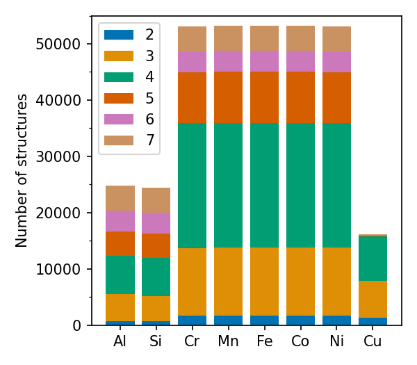
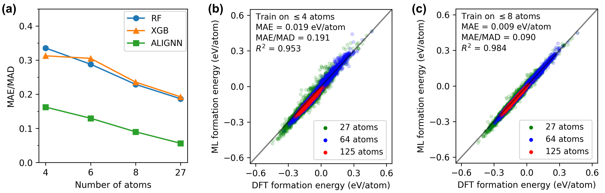
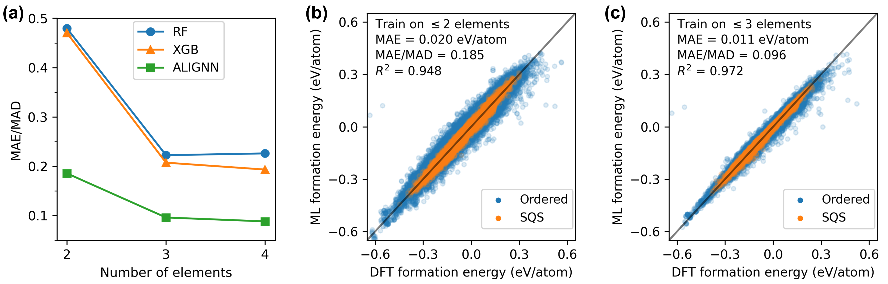
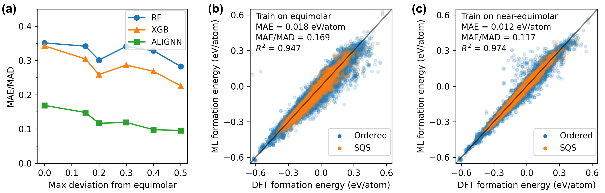
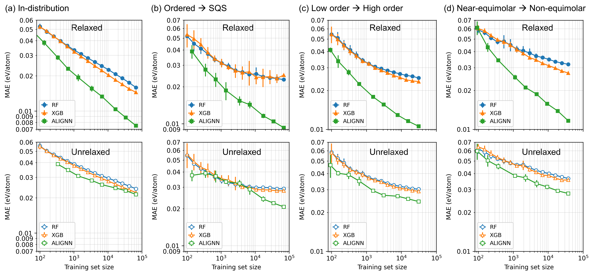
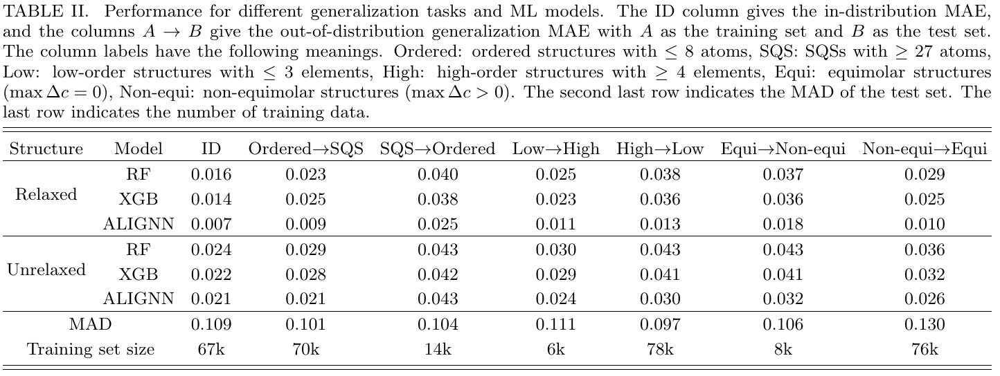

# Efficient first principles based modeling via machine learning: from simple representations to high entropy materials

## Paper (online soon)
This is the repo associated for our paper *Efficient first principles based modeling via machine learning: from simple representations to high entropy materials* (link to be inserted), which we create a large DFT dataset for HEMs and evaluate the in-distribution and out-of-distribution performance of machine learning models. 

## DFT dataset for high entropy alloys 

Our DFT dataset encompasses bcc and fcc structures composed of eight elements and overs all possible 2- to 7-component alloy systems formed by them. 
The dataset used in the paper is publicly available on [Zenodo](https://doi.org/10.5281/zenodo.10854500), which includes initial and final structures, formation energies, atomic magnetic moments and charges among other attributes. 

*Note: The trajectory data (energies and forces for structures during the DFT relaxations) is not published with this paper; it will be released later with our future work on machine learning force fields for HEMs.*

### Table: Numbers of alloy systems and structures.
| No. components             | 2    | 3     | 4     | 5     | 6    | 7    | Total |
|----------------------------|------|-------|-------|-------|------|------|-------|
| Alloy systems              | 28   | 56    | 70    | 56    | 28   | 8    | 246   |
| Ordered (2-8 atoms)        | 4975 | 22098 | 29494 | 6157  | 3132 | 3719 | 69575 |
| SQS (27, 64, or 128 atoms) | 715  | 3302  | 3542  | 4718  | 1183 | 762  | 14222 |
| Ordered+SQS                | 5690 | 25400 | 33036 | 10875 | 4315 | 4481 | 83797 |

### Number of structures as a function of a given constituent element. The legend indicates the number of components.

    

## Generalization performance of machine learning models 
The data on [Zenodo](https://doi.org/10.5281/zenodo.10854500) provide the Matminer features of initial and final structures and a demo script to train tree-based models. The results in the paper can be readily reproduced by adapting the demo script for different train-test splits. The `codes` folder provides the scripts that we used in the paper.*

### Generalization performance from small to large structures.

    

&nbsp;&nbsp; 

### Generalization performance from low-order to high-order systems.

    

&nbsp;&nbsp; 

### Generalization performance from (near-)equimolar to non-equimolar structures.

    

&nbsp;&nbsp; 

### Effects of dataset size and use of unrelaxed vs. relaxed structures

    

&nbsp;&nbsp; 

### Overview of model performance on different generalization tasks

    

